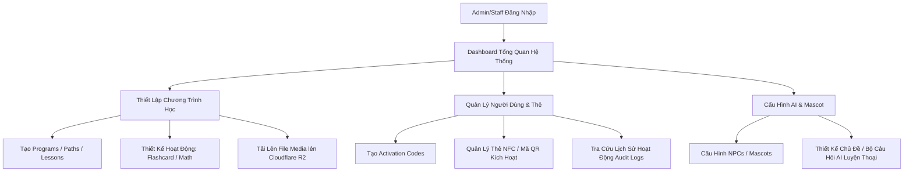
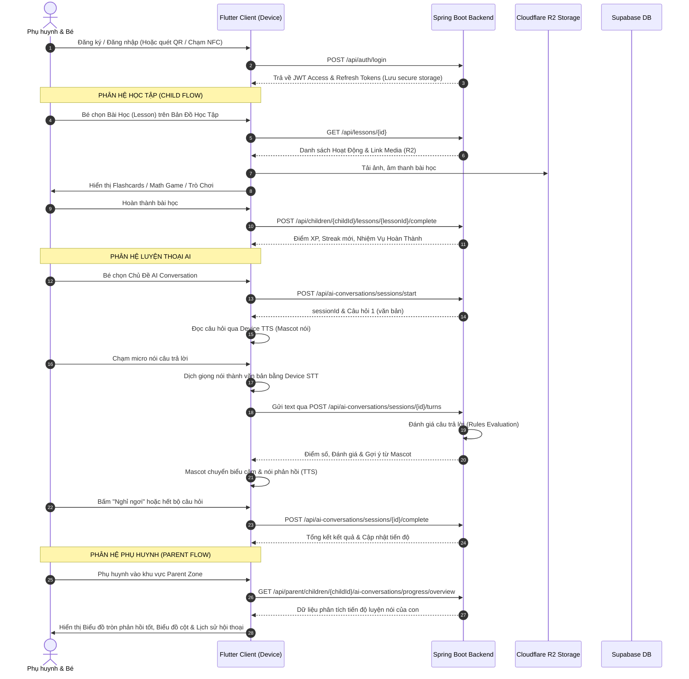

# Project HA - Hệ Thống Quản Lý & Học Tập Cho Trẻ Em

Chào mừng bạn đến với tài liệu hướng dẫn và mô tả hệ thống của **Project HA**. Đây là một nền tảng giáo dục tương tác và hỗ trợ phát triển ngôn ngữ toàn diện dành cho trẻ em, kết hợp với các công cụ quản trị mạnh mẽ dành cho nhà trường, quản trị viên và bảng điều khiển chi tiết cho phụ huynh.

Dự án được xây dựng dựa trên kiến trúc **Backend-Centered (hướng backend)** để đảm bảo tính an toàn dữ liệu, tính nhất quán nghiệp vụ và hiệu năng hoạt động cao trên mọi nền tảng thiết bị.

---

## 📌 Mục Lục (Document Outline)
- [📁 Cấu Trúc Thư Mục Tài Liệu (`docs/`)](#-cấu-trúc-thư-mục-tài-liệu-docs)
- [🛠️ Công Nghệ & Phiên Bản Chi Tiết](#-công-nghệ--phiên-bản-chi-tiết)
  - [1. Spring Boot Backend (`backend`)](#1-spring-boot-backend-backend)
  - [2. Admin Web Portal (`admin-web`)](#2-admin-web-portal-admin-web)
  - [3. Mobile Flutter App (`mobile-flutter`)](#3-mobile-flutter-app-mobile-flutter)
- [🌐 Nền Tảng Deploy Hiện Tại & Đường Dẫn Cấu Thiết Lập](#-nền-tảng-deploy-hiện-tại--đường-dẫn-cấu-hình)
- [🎯 Chi Tiết Tính Năng Hệ Thống](#-chi-tiết-tính-năng-hệ-thống)
  - [1. Hệ thống Xác thực & Quản lý Tài khoản](#1-hệ-thống-xác-thực--quản-lý-tài-khoản)
  - [2. Chương Trình Học Tập & Quản Lý Nội Dung](#2-chương-trình-học-tập--quản-lý-nội-dung)
  - [3. Hệ Thống Gamification](#3-hệ-thống-gamification-game-hóa-giáo-dục)
  - [4. Tương Tác Nói Cùng AI (Guided Speech Feature)](#4-tương-tác-nói-cùng-ai-guided-speech-feature)
- [🔄 Luồng Hoạt Động Của Hệ Thống (Workflows)](#-luồng-hoạt-động-của-hệ-thống-workflows)
  - [🖥️ A. Luồng Hoạt Động Trên Trang Admin Web Portal](#️-a-luồng-hoạt-động-trên-trang-admin-web-portal)
  - [📱 B. Luồng Hoạt Động Trên Mobile Flutter App (Child & Parent Flows)](#-b-luồng-hoạt-động-trên-mobile-flutter-app-child--parent-flows)

---

## 🤖 Thông Tin Đại Diện Hệ Thống
*Áp dụng kiến thức của chuyên gia biên soạn tài liệu `@[documentation-writer]`...*

---

## 📁 Cấu Trúc Thư Mục Tài Liệu (`docs/`)

Để thuận tiện cho việc tham khảo chi tiết, tài liệu kỹ thuật được phân rã thành các bài viết chuyên biệt sau:

- 🏗️ **[Tài liệu Kiến trúc Hệ thống (Architecture)](file:///Users/huy/Documents/project_ha/docs/architecture.md)**: Sơ đồ luồng dữ liệu, phân quyền vai trò (`PARENT`, `ADMIN`, `STAFF`) và cơ chế xác thực JWT.
- 💻 **[Hướng dẫn Phát triển Local (Local Development)](file:///Users/huy/Documents/project_ha/docs/local-development.md)**: Cách thiết lập môi trường, biến cấu hình `.env` và chạy thử nghiệm cục bộ các dịch vụ.
- 🚀 **[Kế hoạch Triển khai (Deployment Plan)](file:///Users/huy/Documents/project_ha/docs/deployment-plan.md)**: Hướng dẫn cấu hình Render, Railway, VPS, Cloudflare Pages, thiết lập CORS và R2 bucket.
- 🗄️ **[Thiết kế Cơ sở Dữ liệu (Database Schema)](file:///Users/huy/Documents/project_ha/docs/database-schema.md)**: Chi tiết về hệ cơ sở dữ liệu Supabase PostgreSQL và các phiên bản migration qua Flyway.
- 🔌 **[Đặc tả APIs (API Spec)](file:///Users/huy/Documents/project_ha/docs/api-spec.md)**: Danh sách toàn bộ các endpoints phục vụ cho Mobile App và Admin Web Portal.
- 🗣️ **[Tính năng Hội thoại AI (AI Conversation)](file:///Users/huy/Documents/project_ha/docs/ai-conversation-feature.md)**: Chi tiết luồng sử dụng của trẻ, bảng điều khiển của phụ huynh, cơ chế STT/TTS và định hướng phát triển Gemini Live qua WebSocket.
- 📦 **[Hướng dẫn Di chuyển từ Firebase (Firebase Migration)](file:///Users/huy/Documents/project_ha/docs/migration-from-firebase.md)**: Bảng đối chiếu các collections cũ của Firebase sang các quan hệ bảng mới trong PostgreSQL.

---

## 🛠️ Công Nghệ & Phiên Bản Chi Tiết

Hệ thống được phát triển trên mô hình monorepo chia làm 3 phân hệ chính:

### 1. Spring Boot Backend (`backend`)
Phục vụ các REST APIs dưới tiền tố `/api/**`, quản lý xác thực, phân quyền và kiểm soát logic nghiệp vụ.
- **Java**: Phiên bản **Java 17** (Spring Toolchain).
- **Framework**: **Spring Boot 3.5.0** và **Spring Security 6.x** hỗ trợ bảo mật.
- **Database Migrations**: **Flyway Core & Flyway Database PostgreSQL** quản lý vòng đời lược đồ.
- **Xác thực**: JWT sử dụng thư viện **io.jsonwebtoken (jjwt-api, jjwt-impl, jjwt-jackson) phiên bản 0.12.6**.
- **Lưu trữ nhị phân**: **AWS S3 SDK for Java (software.amazon.awssdk:s3:2.25.70)** kết nối tương thích với Cloudflare R2 để cấp Presigned Upload URL.
- **SMTP**: **Spring Boot Starter Mail** tích hợp gửi email tự động (mã xác nhận, đặt lại mật khẩu) qua SMTP của Gmail.

### 2. Admin Web Portal (`admin-web`)
Hệ thống quản trị nội bộ dành cho Quản trị viên và Nhân viên trường học.
- **Framework & Builder**: **React 18.3.1** chạy trên **Vite 6.0.3** và **TypeScript 5.7.2**.
- **Định tuyến (Routing)**: **React Router DOM 6.28.0**.
- **Biểu đồ & Phân tích**: **Recharts 2.13.3** để trực quan hóa số liệu học tập của trẻ.
- **Xử lý Dữ liệu**: **Papaparse 5.5.3** (đọc/xuất CSV) và **xlsx 0.18.5** (quản lý tệp cấu hình Excel).
- **Tiện ích**: **qrcode 1.5.4** để tạo mã QR Code động kích hoạt tài khoản/thiết bị trực quan.

### 3. Mobile Flutter App (`mobile-flutter`)
Ứng dụng dành cho trẻ em học tập trực quan và phụ huynh theo dõi tiến độ.
- **Ngôn ngữ & SDK**: **Flutter (Dart SDK ^3.10.8)**.
- **Quản lý trạng thái (State)**: **Provider 6.1.5**.
- **Định tuyến**: **go_router 17.0.0**.
- **Lưu trữ bảo mật**: **flutter_secure_storage 9.2.4** (lưu JWT token an toàn).
- **Xác thực giọng nói & Tương tác âm thanh**: 
  - **speech_to_text 7.0.0** (chuyển đổi giọng nói thành văn bản trực tiếp trên thiết bị trẻ em).
  - **flutter_tts 4.1.0** (tổng hợp giọng Mascot đọc câu hỏi bằng Tiếng Việt).
  - **record 6.2.1** và **audioplayers 6.5.1** (thu âm và phát âm thanh tương tác).
- **Phần cứng & Thiết bị**: 
  - **flutter_nfc_kit 3.4.2** và **ndef 0.4.0** (tương tác thẻ NFC vật lý).
  - **mobile_scanner 7.1.3** (quét mã QR kích hoạt).
  - **permission_handler 11.3.1** (quản lý quyền truy cập Micro, Camera, NFC).
- **Giao diện & Hiệu ứng**: **flutter_animate 4.5.2**, **cached_network_image 3.4.1**, **google_fonts 6.2.0**.

---

## 🌐 Nền Tảng Deploy Hiện Tại & Đường Dẫn Cấu Hình

| Dịch vụ | Nền tảng Deploy | Cơ chế & Đầu ra | Link / Cấu hình chính |
| :--- | :--- | :--- | :--- |
| **Backend** | **Render / Railway / Docker VPS** | Container chạy Dockerfile (`backend/Dockerfile`), đọc cổng từ biến `PORT` | Health Check: `/api/health` |
| **Admin Web** | **Cloudflare Pages** | Build ra thư mục tĩnh `dist/` và deploy CDN | Đọc biến môi trường build: `VITE_API_BASE_URL` |
| **Database** | **Supabase PostgreSQL** | Cung cấp PostgreSQL kết nối JDBC qua SSL | Cấu hình: `sslmode=require` trên cổng `6543` |
| **File Storage** | **Cloudflare R2** | Lưu trữ tệp tin đa phương tiện qua S3 API | Sử dụng `R2_PUBLIC_BASE_URL` để truy cập ảnh/âm thanh |
| **SMTP Server** | **Gmail SMTP** | Gửi email kích hoạt/OTP tự động | Host: `smtp.gmail.com` (Port 587, SSL/TLS qua App Password) |
| **Mobile App** | **Android (APK) & iOS Bundle** | Native Build kèm tham số cấu hình tĩnh | Build Command: `--dart-define=API_BASE_URL=<backend-url>` |

---

## 🎯 Chi Tiết Tính Năng Hệ Thống

### 🔑 1. Hệ thống Xác thực & Quản lý Tài khoản
- **Đăng ký / Đăng nhập**: Xác thực trên JWT an toàn, hỗ trợ cơ chế tự động xoay vòng Access Token (ngắn hạn) và Refresh Token (dài hạn).
- **OTP Email**: Đăng ký và Quên mật khẩu được xử lý thông qua mã OTP bảo mật gửi trực tiếp đến hòm thư người dùng qua Gmail SMTP.
- **Phân quyền vai trò (RBAC)**: Phân quyền rõ ràng giữa `PARENT` (Phụ huynh), `STAFF` (Nhân viên quản lý nội dung), và `ADMIN` (Quản trị viên hệ thống).
- **Kích hoạt NFC/QR**: Cho phép đăng nhập nhanh cho trẻ em hoặc liên kết thẻ NFC học tập vật lý trực tiếp với thiết bị di động.

### 📚 2. Chương Trình Học Tập & Quản Lý Nội Dung
- **Cấu trúc phân cấp**: **Chương trình học (Programs)** ➔ **Bản đồ học tập (Learning Paths)** ➔ **Các chặng (Path Items)** ➔ **Bài học (Lessons)** ➔ **Hoạt động (Activities)**.
- **Đa dạng dạng câu hỏi**:
  - **Flashcards**: Thẻ từ vựng song ngữ kèm hình ảnh sống động và phát âm mẫu.
  - **Math Questions**: Câu hỏi toán học tương tác giúp trẻ phát triển tư duy logic.
  - **Dialogues & Speech**: Giao tiếp nói tương tác nâng cao khả năng phát âm.
- **Quản lý Kho tài nguyên**: Upload hình ảnh, video và tệp âm thanh trực tiếp lên Cloudflare R2 thông qua cơ chế Presigned URL cực kỳ bảo mật (tệp tin được tải thẳng từ client lên R2 mà không đi qua băng thông trung gian của backend).

### 🏆 3. Hệ Thống Gamification (Game hóa giáo dục)
- **Hệ thống Mascot & NPCs**: Các nhân vật Mascot sinh động đồng hành cùng bé. Trẻ có thể mở khóa các NPC mới bằng số điểm XP tích lũy được.
- **Nhiệm vụ hàng ngày (Daily Missions)**: Hệ thống tự động sinh nhiệm vụ giúp bé hình thành thói quen học tập đều đặn (như hoàn thành 2 bài học, luyện nói 5 phút...).
- **Chuỗi ngày học tập (Streaks)**: Ghi nhận chuỗi ngày học tập liên tiếp nhằm thúc đẩy động lực cho trẻ.
- **Huy hiệu Thành tích (Badges)**: Trao tặng các huy hiệu độc đáo khi bé đạt được các cột mốc quan trọng trong quá trình học.

### 🗣️ 4. Tương Tác Nói Cùng AI (Guided Speech Feature)
- **Trải nghiệm đàm thoại định hướng (Guided)**: Giúp bé luyện tập nói các câu trả lời ngắn dựa trên bối cảnh của Mascot đưa ra.
- **Bộ máy Chấm điểm Backend**: Backend nhận văn bản thô chuyển từ thiết bị, thực hiện so khớp từ khóa (Keyword match) và ngữ nghĩa câu trả lời để chấm điểm thông minh.
- **Bảo vệ Trẻ em & Tâm lý học**: Hệ thống kiểm duyệt tuyệt đối không nói từ "Sai", không đưa ra chẩn đoán tiêu cực hoặc nhắc đến khuyết tật phát triển. Mascot luôn động viên bé một cách tích cực nhất (*"Gần đúng rồi con, thử lại nhé!"*).
- **Quyền riêng tư tuyệt đối**: Ứng dụng không bao giờ lưu trữ tệp âm thanh thô lên máy chủ để đảm bảo tính an toàn dữ liệu sinh trắc học của trẻ.

---

## 🔄 Luồng Hoạt Động Của Hệ Thống (Workflows)

### 🖥️ A. Luồng Hoạt Động Trên Trang Admin Web Portal

1. **Đăng nhập & Giám sát**: Admin/Staff đăng nhập bằng tài khoản backend cấp. Dashboard hiển thị các biểu đồ (được vẽ bằng `Recharts`) thống kê lượt kích hoạt thiết bị, tiến độ học tập toàn hệ thống.
2. **Xây dựng Giáo trình (Curriculum Builder)**:
   - Tạo bài học mới và thêm hoạt động tương tác.
   - Khi tải lên hình ảnh minh họa cho bài học: Admin gửi yêu cầu lấy Presigned URL từ Backend ➔ Backend sinh URL có thời hạn hợp lệ ➔ Web client tải file trực tiếp lên Cloudflare R2 ➔ Lưu lại đường dẫn công khai vào Database PostgreSQL qua API `/api/media/complete-upload`.
3. **Quản lý Thẻ & Kích hoạt**:
   - Quản trị viên sử dụng tính năng **Activation Codes** để sinh ra danh sách mã kích hoạt hàng loạt cho phụ huynh mua khóa học.
   - Có thể sinh mã **QR Code** để in ra các thẻ học tập tương tác vật lý.
4. **Cấu hình Hội thoại AI**:
   - Quản lý danh mục các chủ đề (`ai_conversation_topics`) và câu hỏi kèm đáp án mong đợi, từ khóa chấp nhận (`ai_conversation_questions`).

---

### 📱 B. Luồng Hoạt Động Trên Mobile Flutter App (Child & Parent Flows)

1. **Khởi tạo & Kích hoạt**: 
   - Phụ huynh đăng nhập và liên kết tài khoản bé bằng cách nhập mã kích hoạt hoặc quét mã QR/chạm thẻ NFC học tập đã được trường cung cấp.
2. **Học tập trên Bản đồ (Learning Map)**:
   - Bé di chuyển trên bản đồ học tập sinh động và chọn bài học.
   - Bé giải các câu đố toán, học từ vựng qua thẻ Flashcard, nghe phát âm và nhận điểm XP tương ứng.
3. **Trải nghiệm Tương tác nói với AI**:
   - Bé vào mục luyện thoại AI ➔ Hệ thống tải câu hỏi từ Backend ➔ Mascot phát giọng đọc câu hỏi (TTS trên thiết bị).
   - Bé bấm nút ghi âm màu cam để nói ➔ Điện thoại phân tích giọng nói ra văn bản (STT trên thiết bị) ➔ Gửi văn bản lên backend chấm điểm ➔ Mascot thay đổi hoạt cảnh biểu cảm (Vui/Cổ vũ) và nói nhận xét phản hồi đến bé.
4. **Phụ huynh quản lý (Parent Zone)**:
   - Phụ huynh chuyển sang Dashboard dành riêng cho bố mẹ để xem con hôm nay học bao nhiêu phút, biểu đồ phản xạ từ vựng của con qua từng chủ đề nói, và nhận những lời khuyên hữu ích để trò chuyện cùng con tại nhà.
