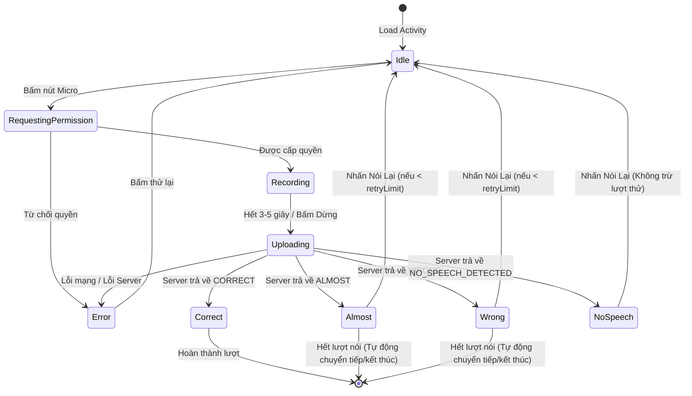

# Thiết kế Tương tác & Trải nghiệm AI Voice Quiz MVP

Tài liệu này đặc tả chi tiết giao diện di động, kịch bản tương tác và luồng nghiệp vụ của **Voice Quiz (VOICE_ANSWER)** từ góc độ lập trình viên di động và thiết kế sản phẩm.

---

## 1. Luồng Người dùng & Trạng thái UI (7 States)

Màn hình hiển thị hoạt động nói `VoiceAnswerRenderer` quản lý micro và hiển thị trạng thái động qua 7 trạng thái rõ rệt để trẻ nhỏ (và phụ huynh) dễ dàng theo dõi:

### Chi tiết các trạng thái trên UI:
1. **`Idle` (Chờ nói)**:
   - Hiển thị nút Microphone màu xanh dương bo tròn lớn, có sóng động nhẹ để thu hút trẻ.
   - Text hướng dẫn: *"Bé nhấn vào micro để trả lời nhé!"*.
2. **`RequestingPermission` (Xin quyền)**:
   - Hiển thị vòng xoay tải (loading) nhỏ.
   - Tránh việc trẻ bấm liên tục khi hệ thống đang gọi pop-up của hệ điều hành.
3. **`Recording` (Đang thu âm)**:
   - Nút Micro đổi sang màu đỏ, có hiệu ứng sóng âm (Waveform/Ripple) chuyển động theo nhịp.
   - Đếm ngược hiển thị từ 3 hoặc 5 giây về 0.
   - Có thể bấm nút dừng sớm nếu trẻ đã nói xong.
   - Text hướng dẫn: *"Mimi đang nghe con nói đây..."*.
4. **`Uploading` (Đang xử lý)**:
   - Hiển thị spinner loading.
   - Text hướng dẫn: *"Mimi đang suy nghĩ..."*.
5. **`Correct` / `Almost` / `Wrong` (Kết quả)**:
   - **Correct**: Nút Micro chuyển sang màu xanh lá kèm dấu check `✓`. Hiện text: *Mimi nghe được: "[transcript]"* và câu khen ngợi (ví dụ: *"Tuyệt vời! Mimi đã nghe thấy rồi!"*). Phát âm thanh chúc mừng.
   - **Almost**: Nút Micro chuyển sang màu vàng kèm dấu chấm than `!`. Hiện text: *Mimi nghe được: "[transcript]"* kèm gợi ý nói to/rõ hơn.
   - **Wrong**: Nút Micro chuyển sang màu đỏ kèm dấu nhân `×`. Hiện text: *Mimi nghe được: "[transcript]"* kèm câu động viên.
6. **`NoSpeech` (Không có giọng nói)**:
   - Nút Micro chuyển sang màu cam kèm biểu tượng mic bị tắt.
   - Hiện text: *"Mimi chưa nghe rõ con nói gì, con hãy nói to hơn một chút nhé!"*.
   - Cho phép bấm **"Nói lại"** để quay về trạng thái `Idle` và thực hiện lại mà không bị tăng số lần thử (`_retriesUsed`) hay bị trừ lượt.
7. **`Error` (Lỗi hệ thống)**:
   - Hiển thị thông báo thân thiện: *"Có lỗi kết nối micro hoặc mạng. Bé thử lại nhé."*.
   - Cho phép bấm nút "Thử lại" để quay về trạng thái `Idle`.

---

## 2. Quản lý lượt nói (Retry Limits)

* Mỗi hoạt động nói có trường `retryLimit` (ví dụ: 2 lượt).
* Hệ thống di động giữ một biến đếm `_attemptsCount`.
* Khi kết quả là `WRONG` hoặc `ALMOST`:
  - Nếu `_attemptsCount < retryLimit`: Hiển thị nút **"Nói lại"** để trẻ thử lại.
  - Nếu `_attemptsCount >= retryLimit`: Nút nói lại sẽ bị ẩn. Trẻ sẽ tự động được hoàn thành hoạt động đó với kết quả ghi nhận gần nhất, hoặc hệ thống hiển thị nút **"Tiếp tục"** để chuyển sang hoạt động tiếp theo trong bài học nhằm tránh gây ức chế cho trẻ khi không phát âm được đúng từ khóa.

---

## 3. Khóa Premium Gate (Parent-facing Paywall)

Do Voice Quiz là tính năng tốn tài nguyên máy chủ, nó bị khóa cứng cho tài khoản PREMIUM/TRIAL.
* Khi trẻ mở bài học có chứa hoạt động giọng nói:
  - Nếu tài khoản là FREE hoặc hết hạn cước, màn hình hoạt động sẽ không hiển thị nút Micro.
  - Thay vào đó, một **Banner khóa Premium** màu vàng sang trọng sẽ hiển thị với nội dung: *"Tính năng trả lời bằng giọng nói chỉ dành cho thành viên Premium."*.
  - Có một nút **"Kích hoạt gói Premium"** dẫn phụ huynh đến Parent Gate (Yêu cầu nhập phép tính bảo mật để xác nhận là phụ huynh) trước khi mở Paywall, tránh việc trẻ em tự ý thao tác mua hàng hoặc nâng cấp gói.

---

## 4. Chế độ Mock & Demo khi phát triển (kDebugMode)

Để hỗ trợ phát triển chéo nền tảng (đặc biệt khi chạy trên Web Simulator không hỗ trợ cổng micro native tốt hoặc chạy trên Emulator không có micro thực tế):
* Khi ứng dụng chạy ở chế độ **Debug** (`kDebugMode = true`) và cờ mock ở server đang bật:
  - Giao diện hiển thị thêm một cụm **Quick Mock Input** ở góc dưới màn hình.
  - Lập trình viên hoặc tester có thể gõ nhanh từ khóa (hoặc chọn đáp án mẫu trong dropdown) và bấm **"Gửi Mock"** để giả lập việc trẻ đã nói từ đó.
  - Payload gửi lên Cloud Function sẽ đính kèm tham số `mockTranscript`. Server sẽ xử lý so khớp và trả về kết quả giống hệt như nhận diện giọng nói thật.
  - **Lưu ý giao diện**: Trình mô phỏng hiển thị dòng chữ *"Chế độ Mock Demo"* để phân biệt rõ với tính năng nhận diện thật.
