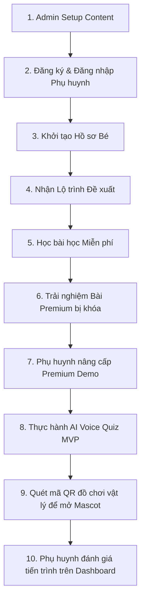

# Kịch Bản Thuyết Trình & Demo Sản Phẩm (End-to-End Demo Script)

Tài liệu này cung cấp kịch bản từng bước để thực hiện demo toàn bộ hệ thống hỗ trợ học tập và đồng hành cùng trẻ tự kỷ/chậm nói **Project HA** bao gồm: **Cổng Admin Web**, **Ứng dụng di động (Flutter)**, và các logic backend bảo mật.

---

## 🎬 TÓM TẮT LUỒNG DEMO

---

## 🛠️ PHẦN CHUẨN BỊ (PRE-DEMO SETUP)
1. **Server Cloud Functions**: Đảm bảo Local Emulator hoặc Cloud Functions đã được deploy ổn định (`submitVoiceAnswer`, `adminGrantPremium`, `adminRevokePremium`, `demoUpgradePremium`).
2. **Admin Web**: Truy cập trang Cổng quản trị (local port hoặc deploy link).
3. **Thiết bị Di động/Giả lập**: Mở ứng dụng di động Project HA. Đảm bảo tài khoản test đã được xóa sạch dữ liệu cũ để demo flow đăng ký mới.

---

## 🚀 KỊCH BẢN CHI TIẾT TỪNG BƯỚC

### Bước 1: Admin thiết lập nội dung học tập (Admin Setup)
* **Mục tiêu**: Demo khả năng quản lý nội dung đa dạng của Cổng Quản Trị (Admin Portal), đồng thời chuẩn bị sẵn bài học và mã QR đồ chơi.
* **Các bước thực hiện**:
  1. Đăng nhập vào Admin Web bằng tài khoản có role `ADMIN`.
  2. Đi tới trang **Phân loại (Taxonomy)**: Giới thiệu 3 nhóm: *Nhóm Khó Khăn Phát Triển* (ví dụ: Chậm nói - SPEECH_DELAY), *Mục Tiêu Học Tập* (Nhận biết từ vựng), và *Kỹ Năng* (Nghe hiểu). Chỉ ra các dấu sao đỏ `*` bắt buộc.
  3. Đi tới trang **Mascot (NPC) v2**: Nhấn *Thêm Mascot* để tạo bạn nhỏ đồng hành mới:
     - Tên: `Mèo Mimi`
     - Loại truy cập: `PREMIUM` (Yêu cầu tài khoản Premium mới được chọn bạn này đồng hành).
     - Bấm *Xem trước* (Preview) để kiểm tra giao diện hiển thị.
  4. Đi tới trang **Bài học v2 (Lessons)**: Tạo một bài học kiểm thử:
     - Tiêu đề: `Làm quen loài vật xung quanh`
     - Loại bài học: `VOICE_QUIZ` (Hoạt động nói AI Voice Quiz).
     - Loại truy cập: `PREMIUM`.
     - Chọn Mascot đồng hành: `Mèo Mimi`.
  5. Đi tới trang **Xây dựng hoạt động (Activity Builder)**: Chọn bài học vừa tạo, bấm *Thêm Hoạt Động*:
     - Loại hoạt động: `VOICE_ANSWER` (Trả lời bằng giọng nói).
     - Đề bài: `Con mèo kêu thế nào nhỉ?`
     - TTS Prompt: `Con hãy bắt chước tiếng kêu của bạn mèo Mimi nhé.`
     - Đáp án chấp nhận: `meo meo, meo`
     - Số lần thử lại: `3`
     - Bấm chọn checkbox `Yêu cầu Premium Voice` (chỉ bé Premium mới được làm).
  6. Đi tới trang **Mã kích hoạt (Activation Codes)**: Tạo một mã QR gắn với Mascot `Mèo Mimi`:
     - Mã: Tự sinh ngẫu nhiên (VD: `HA-MIMI2026`).
     - Nhãn: `QR Mở Khóa Mascot Mèo Mimi`.
     - Loại kích hoạt: `NPC`.
     - Đối tượng: Chọn `Mèo Mimi`.
     - Bấm *Tạo QR Preview* $\rightarrow$ Chụp hoặc tải ảnh QR này về điện thoại/máy tính để lát nữa quét mở khóa.

---

### Bước 2: Phụ huynh đăng ký & đăng nhập (Parent Registration)
* **Mục tiêu**: Trải nghiệm quy trình đăng ký tài khoản nhanh chóng, thân thiện.
* **Các bước thực hiện**:
  1. Trên app di động, nhấn **Đăng ký**.
  2. Nhập Email, Họ tên phụ huynh và Mật khẩu. Nhấn **Đăng ký**.
  3. Màn hình yêu cầu xác thực email hiện ra (ở chế độ Demo hoặc Local, hệ thống cho phép tiếp tục hoặc hiển thị banner cảnh báo nhẹ nhàng màu vàng dịu mắt ở Home).
  4. Nhấn **Tiếp tục** để vào màn hình chính.

---

### Bước 3: Thiết lập Hồ sơ Bé (Child Profile)
* **Mục tiêu**: Thu thập các thông tin cơ bản về tuổi, sở thích, thế mạnh và các khó khăn phát triển của trẻ.
* **Các bước thực hiện**:
  1. Ứng dụng tự động dẫn tới màn hình **Tạo Hồ sơ Bé** (hoặc nhấn biểu tượng hồ sơ).
  2. Nhập tên bé (ví dụ: `Bé Bôm`), tuổi: `4`.
  3. Chọn các nhóm khó khăn phát triển: `Chậm nói (SPEECH_DELAY)`.
  4. Chọn mục tiêu học tập mong muốn: `Nhận biết và gọi tên đồ vật`.
  5. Chọn sở thích của bé: `Động vật`, `Âm nhạc`.
  6. Nhấn **Lưu hồ sơ**.

---

### Bước 4: Đề xuất Lộ trình học (Path Recommendation)
* **Mục tiêu**: Thuật toán tự động khớp hồ sơ bé để đề xuất chương trình và lộ trình học tập tối ưu nhất.
* **Các bước thực hiện**:
  1. Trở về màn hình **Home**. Một Card đề xuất lớn màu cam pastel hiện ra: *"Bé chưa chọn lộ trình học phù hợp. Nhấn vào đây để khám phá các lộ trình học phù hợp nhất!"*
  2. Nhấn vào Card $\rightarrow$ Hệ thống tự động chuyển sang trang **Chọn Lộ Trình (Path Selection)**.
  3. Hệ thống hiển thị Lộ trình được đề xuất hàng đầu dựa trên bộ lọc: Lộ trình cho bé 4 tuổi bị chậm nói học từ vựng (ví dụ: *Lộ trình giao tiếp cơ bản với động vật*).
  4. Nhấn **Chọn lộ trình này** $\rightarrow$ Hệ thống xác nhận và liên kết lộ trình vào tài khoản của bé.

---

### Bước 5: Học bài học Miễn phí (Free Lesson)
* **Mục tiêu**: Trải nghiệm giao diện bài học trẻ em trực quan, nút bấm cực to, bo góc lớn, font chữ Nunito tròn trịa dễ thương.
* **Các bước thực hiện**:
  1. Tại màn hình **Home**, Card hoạt động hôm nay đã đổi thành bài học tiếp theo miễn phí (VD: *Bài học 1: Chào hỏi bạn bè*).
  2. Bấm **Bắt đầu học** $\rightarrow$ Đi vào chi tiết bài học $\rightarrow$ Bấm **Bắt đầu**.
  3. Trải nghiệm 2 màn hình hoạt động trắc nghiệm (`ChoiceAnswerRenderer`):
     - Câu hỏi có hình ảnh to rõ ràng, các nút đáp án bo góc tròn lớn (`AppRadius.lg`).
     - Bé chọn đúng $\rightarrow$ Hiệu ứng chúc mừng rực rỡ $\rightarrow$ Chuyển màn.
     - Hoàn thành bài học $\rightarrow$ Màn hình Kết quả xuất hiện $\rightarrow$ Bé được cộng 10 XP và tăng Streak.

---

### Bước 6: Trải nghiệm Bài Premium bị khóa (Premium Locked Content)
* **Mục tiêu**: Xác thực hệ thống kiểm soát truy cập (Access Control) chặn bé miễn phí truy cập nội dung trả phí.
* **Các bước thực hiện**:
  1. Nhấn nút **Lộ trình học** ở Home để mở Bản đồ Lộ trình (`learning_map.dart`).
  2. Cuộn bản đồ xuống dưới, tìm đến bài học `Làm quen loài vật xung quanh` (được cấu hình là Premium ở Bước 1).
  3. Bài học hiển thị Icon Vương miện cam pastel kèm chữ **Premium** rõ ràng ở góc thẻ.
  4. Nhấn vào bài học $\rightarrow$ Màn hình chi tiết bài học mở ra, nút bấm đổi thành màu cam: **Mở khóa Premium cho bé**.
  5. Nhấn nút mở khóa $\rightarrow$ Hệ thống kích hoạt **Cổng Phụ Huynh (Parent Gate)** (yêu cầu phụ huynh trả lời phép tính nhân, ví dụ: 7 x 8 = ? để tránh trẻ tự bấm vào).
  6. Sau khi phụ huynh giải đúng toán $\rightarrow$ Ứng dụng mở trang **Nâng cấp gói Premium (Paywall Screen)**.

---

### Bước 7: Phụ huynh nâng cấp Premium Demo (Premium Upgrade Demo)
* **Mục tiêu**: Thể hiện quy trình kích hoạt Premium ảo (Demo Upgrade) không tốn tiền thật nhưng thay đổi toàn bộ trạng thái hệ thống qua server-authoritative logic.
* **Các bước thực hiện**:
  1. Tại trang **Paywall**, chỉ rõ dòng cảnh báo: *"Lưu ý: Đây là bản demo kiểm thử. Dự án không tích hợp thanh toán thật để bảo vệ người dùng."*
  2. Phụ huynh bấm nút **Kích hoạt Premium Demo**.
  3. Hệ thống gửi yêu cầu qua Callable Function `demoUpgradePremium`.
  4. Sau 1 giây, popup thông báo thành công: *"Tài khoản của bạn đã được nâng cấp lên gói PREMIUM (Demo) thành công. Hạn dùng 30 ngày."*
  5. Quay lại màn hình Bản đồ Lộ trình $\rightarrow$ Bài học `Làm quen loài vật xung quanh` đã được mở khóa (biểu tượng khóa biến mất, nút bấm đổi thành màu xanh lá **Bắt đầu học ngay**).

---

### Bước 8: Thực hành hoạt động nói AI Voice Quiz (Voice Quiz Mock Demo)
* **Mục tiêu**: Demo MVP của tính năng AI Voice Quiz giúp trẻ luyện phát âm, phản hồi tức thời.
* **Các bước thực hiện**:
  1. Vào bài học `Làm quen loài vật xung quanh`, bấm **Bắt đầu học ngay**.
  2. Màn hình hoạt động nói (`VoiceAnswerRenderer`) mở ra.
  3. Chỉ rõ nhãn màu xanh dương phía dưới: `🎙️ CHẾ ĐỘ MOCK DEMO (Phát âm được giả lập qua text nhập dưới)`. Giải thích rằng hệ thống chạy bằng Mock Provider trên Cloud Functions để test logic và tiết kiệm chi phí API trong quá trình thuyết trình.
  4. Thử nghiệm case 1: **Trẻ không nói gì / nói quá bé (No Speech)**:
     - Nhấp chọn Micro $\rightarrow$ Giữ im lặng trong 5 giây (hoặc server tự nhận diện không có âm thanh).
     - Hệ thống chuyển sang trạng thái màu cam nổi bật với icon micro tắt: *"Mimi chưa nghe rõ con nói gì, con hãy nói to hơn một chút nhé!"*.
     - Giải thích: Hệ thống không tính đây là lượt trả lời sai, không trừ số lượt làm lại (`retryLimit` vẫn giữ nguyên là 3). Bé có thể bấm **Bé nói lại nhé!** để nói lại ngay.
  5. Thử nghiệm case 2: **Nhập đáp án giả lập (Mock Input)**:
     - Tại ô text của Dev Mode phía dưới, nhập từ: `con meo` (đáp án gần đúng). Bấm **Gửi Mock**.
     - Hệ thống xử lý, hiển thị biểu tượng ngôi sao màu cam kèm phản hồi khích lệ: *"Gần đúng rồi, con cố lên chút nữa nhé!"*.
     - Giải thích: Số lần thử lại bị trừ đi 1 (`Lượt làm lại: 1 / 3`).
     - Nhập tiếp từ: `meo meo` (đáp án chính xác). Bấm **Gửi Mock**.
     - Hệ thống phát âm thanh chúc mừng, hiển thị tích xanh lá: *"Bé giỏi quá! Đáp án chính xác rồi!"* và tự động hoàn thành hoạt động, đưa bé sang màn hình Kết quả bài học.

---

### Bước 9: Quét mã QR đồ chơi vật lý để mở Mascot (QR/NPC Unlock)
* **Mục tiêu**: Mô phỏng tương tác giữa ứng dụng di động và đồ chơi vật lý/sách học bằng mã QR.
* **Các bước thực hiện**:
  1. Nhấn nút **Quét QR** ở màn hình Home di động.
  2. Camera giả lập hoặc thật mở ra. Quét hình ảnh mã QR (đã chuẩn bị ở Bước 1 - mã `HA-MIMI2026`).
  3. Hệ thống gửi mã lên Firestore/Functions để xác thực và kích hoạt.
  4. Màn hình chúc mừng xuất hiện: *"Chinh phục Mascot mới! Bạn Mèo Mimi đã đồng hành cùng con!"*.
  5. Nhấp vào nút **Bộ sưu tập Mascot** ở Home $\rightarrow$ Bạn `Mèo Mimi` đã sáng lên (mở khóa thành công), khi nhấp vào sẽ phát ra lời thoại mặc định: *"Xin chào bé! Hôm nay mình học gì nhỉ?"*.

---

### Bước 10: Phụ huynh kiểm tra tiến trình học (Parent Dashboard Review)
* **Mục tiêu**: Giúp phụ huynh nắm bắt chi tiết, trực quan tiến bộ của con qua dữ liệu thực tế, tuân thủ nguyên tắc không fake data và có giao diện tối giản, sạch sẽ.
* **Các bước thực hiện**:
  1. Nhấn chọn nút **Phụ huynh** ở Home.
  2. Hệ thống yêu cầu giải Parent Gate để xác minh người dùng là phụ huynh.
  3. Mở ra **Bảng Phụ Huynh (Parent Dashboard)**:
     - Chỉ ra thanh tiến trình (progress bar) thiết kế dạng ngang tối giản, tinh tế.
     - Hiển thị chính xác các chỉ số: số bài đã học (`2` bài), tổng XP tích lũy, số ngày học liên tục (Streak).
     - Phần **Kỹ năng**: Hiển thị biểu đồ phân bổ các kỹ năng thực tế bé đã thực hành (ví dụ: Nghe hiểu: 80%, Phát âm: 65%...).
     - Chỉ ra phần **Hoạt động gần đây**: Liệt kê chi tiết tên bài học, số điểm và thời gian bé đã học.
     - Chỉ ra các **Gợi ý tại nhà** (khen nỗ lực của bé, đồng hành tương tác) giúp phụ huynh có định hướng tương tác ngoài đời thực với trẻ.

---

## 💡 CÁC ĐIỂM SÁNG CẦN NHẤN MẠNH KHI THUYẾT TRÌNH (TALKING POINTS)
* **Purple Ban & Child-friendly Design**: Toàn bộ ứng dụng di động sử dụng font chữ Nunito bo tròn nhẹ và các màu sắc pastel dịu mát (Mint, Peach, Sky, Coral). Tuyệt đối không dùng màu tím rực gây mỏi mắt hay kích động cho trẻ đặc biệt.
* **Server-authoritative Security**: Toàn bộ việc cấp phát Premium, kiểm tra quyền truy cập AI Voice, mở khóa Mascot QR đều được tính toán và khóa chặt ở Firestore Security Rules và Cloud Functions. Client tuyệt đối không thể tự sửa data để hack quyền.
* **Mock Provider thực tế**: AI Voice Quiz có chế độ Mock thông minh cho phép giả lập đầu vào giọng nói để demo trơn tru trên mọi môi trường (Web giả lập, điện thoại không có mic) và tối ưu chi phí vận hành.
* **Sự rõ ràng về mặt sản phẩm**: Các thông tin y tế, chẩn đoán đều có cảnh báo rõ ràng. Dashboard phụ huynh minh bạch, không chế tác dữ liệu giả để đảm bảo tính giáo dục nghiêm túc.
