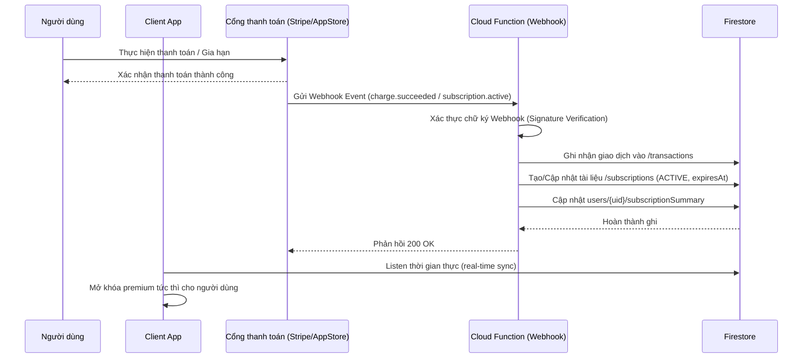

# Kế hoạch tích hợp Cổng thanh toán thật (Future Plan)

Tài liệu này vạch ra kiến trúc, các bước và lưu ý bảo mật để chuyển đổi từ cơ chế Premium Demo (giả lập) sang tích hợp thanh toán thật trong tương lai.

---

## 1. Lựa chọn giải pháp Thanh toán

Để phân phối ứng dụng và dịch vụ trên cả mobile và web, chúng ta cần triển khai các kênh thanh toán sau:

### Kênh Mobile (Trong ứng dụng)
Bắt buộc phải tuân thủ chính sách của Google Play Store và Apple App Store đối với nội dung số (Digital goods/Subscriptions):
* **Google Play Billing** (Android)
* **Apple In-App Purchase (IAP)** (iOS)
* *Thư viện đề xuất:* Dùng plugin Flutter [purchases_flutter](https://pub.dev/packages/purchases_flutter) (RevenueCat) hoặc [in_app_purchase](https://pub.dev/packages/in_app_purchase) chính chủ để quản lý biên lai (receipts) và trạng thái mua hàng một cách thống nhất.

### Kênh Web (Trang landing page / Parent portal)
Nếu người dùng đăng ký qua trang web (để tối ưu hóa chiết khấu 15-30% của store):
* **Stripe:** Dành cho thanh toán thẻ quốc tế (Visa, Mastercard, Link).
* **MoMo / VNPay:** Dành cho thị trường Việt Nam (Quét mã QR, ví điện tử, ATM nội địa).

---

## 2. Kiến trúc Webhook & Server-authoritative

Tuyệt đối không tin tưởng hoàn toàn vào dữ liệu do client gửi lên. Mọi thay đổi về trạng thái cước phải được xử lý bất đồng bộ thông qua Webhook từ cổng thanh toán gửi tới Cloud Functions của chúng ta.

---

## 3. Quản lý trạng thái Subscription ở Server-side

Khi tích hợp thật, Cloud Function cần lắng nghe các sự kiện:
1. `subscription.created` / `subscription.active`: Cấp quyền Premium, set `expiresAt`, set entitlements.
2. `subscription.updated` (Gia hạn / Thay đổi gói): Cập nhật `expiresAt` mới.
3. `subscription.canceled` / `subscription.expired`: Thu hồi quyền (chuyển status thành `CANCELED`/`EXPIRED`, xóa các cờ entitlements nhạy cảm, đặt `plan = FREE`).

---

## 4. Các lưu ý về Bảo mật & Gian lận

* **Xác thực chữ ký Webhook (Webhook Signature Validation):** Bắt buộc phải cấu hình Webhook Signing Secret trong Cloud Function để xác thực mọi request gửi tới thực sự đến từ Stripe/Google/Apple chứ không phải hacker gửi fake request.
* **Xác thực Biên lai (Receipt Validation):** Đối với IAP (Google/Apple), Cloud Function phải gọi API của Apple App Store/Google Play Developer API để verify biên lai mua hàng trước khi ghi nhận thành công.
* **Không lưu thông tin nhạy cảm:** Không tự ý lưu trữ số thẻ tín dụng hoặc thông tin ngân hàng của khách hàng trên hệ thống Firestore. Giao hoàn toàn việc lưu trữ này cho các cổng thanh toán đạt chứng chỉ PCI-DSS (Stripe).
