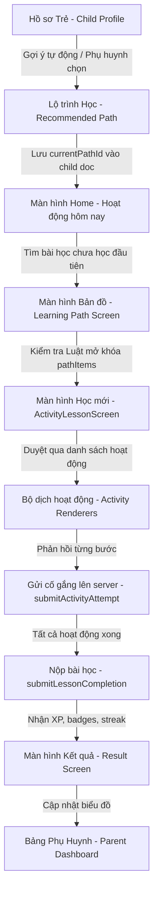

# Hướng dẫn Luồng Học Tập Giai đoạn 4 (Phase 4 Mobile Flow)

Tài liệu này giải thích luồng nghiệp vụ học tập mới của ứng dụng di động Flutter sau khi nâng cấp ở Giai đoạn 4. Luồng học tập đã được chuyển dịch từ các bài học tuyến tính cũ sang hệ thống lộ trình cá nhân hóa dựa trên dữ liệu thật.

---

## Cấu trúc Luồng Học Tập Mới

---

## Chi tiết các bước trong Luồng

### 1. Hồ sơ Trẻ & Lựa chọn Lộ trình
- Trẻ có hồ sơ bao gồm các trường: Khó khăn phát triển (`primaryDifficulty`), sở thích (`interests`), mục tiêu học tập (`learningGoals`), và các trường lưu trữ lộ trình đang học: `currentPathId`, `currentProgramId`, `selectedAt`.
- Màn hình **PathSelectionScreen** (`/path-selection`) lấy dữ liệu các chương trình (`programs`) và lộ trình (`learningPaths`) được xuất bản trên Firestore.
- Sử dụng `PathRecommendationService` để tính điểm phù hợp của từng lộ trình với đặc điểm trẻ. Lộ trình có điểm cao nhất sẽ nhận huy hiệu **"Đề xuất tốt nhất"**.
- Khi phụ huynh nhấn nút chọn, ứng dụng gọi `ChildRepository.saveCurrentPath` ghi nhận trực tiếp vào tài liệu `children/{childId}` trên Firestore (được bảo vệ bởi Firestore rules, chỉ cho phép chỉnh sửa các trường an toàn).

### 2. Gợi ý bài học tại trang Home (Today Activity)
- Tại màn hình **HomeScreen**:
  - Nếu trẻ chưa có `currentPathId`, hệ thống hiển thị một banner khuyến khích: *"Nhấn vào đây để khám phá các lộ trình học phù hợp nhất cho bé!"* dẫn đến màn hình chọn lộ trình.
  - Nếu trẻ đã chọn lộ trình, hệ thống gọi `LessonRepository.currentLearningPlan` và `progress` để tự động xác định bài học tiếp theo chưa hoàn thành (Today Activity).
  - Trẻ có thể nhấn nút **"Bắt đầu học"** để học ngay bài học tiếp theo này thông qua màn hình `/lesson/:id/activity`.
  - Hiển thị bóng nói của Mascot/NPC chào mừng dựa trên trường `dialogueTemplates.welcome` của NPC được lưu trên Firestore.
  - Hiển thị thẻ nhẹ nhàng nhắc nhở **"Hoàn thiện hồ sơ"** nếu hồ sơ trẻ còn thiếu sở thích hoặc khó khăn phụ.

### 3. Bản đồ bài học (Learning Path Screen)
- Giao diện **LearningPathScreen** hiển thị bản đồ bài học (`LearningMap`) dựa trên danh sách các `pathItems` của lộ trình học thật.
- Các nút bài học (`LessonNode`) được đánh giá trạng thái mở khóa theo luật:
  - `completed`: Đã hoàn thành.
  - `current`: Bài học tiếp theo trẻ nên làm (chưa hoàn thành đầu tiên).
  - `available`: Sẵn sàng học.
  - `locked`: Khóa (ví dụ do bài trước chưa hoàn thành, hoặc do quy tắc mở khóa thủ công).
  - `premiumLocked`: Chỉ dành cho tài khoản nâng cấp (Premium). Khi nhấp vào, hiển thị hộp thoại hướng dẫn nhập mã kích hoạt kích hoạt bài học.

### 4. Giao diện học thống nhất (ActivityLessonScreen)
- Màn hình **ActivityLessonScreen** thay thế các màn hình học riêng lẻ trước đây.
- Nạp danh sách các `activities` của bài học từ collection `activities`. Nếu là bài học cũ (legacy fallback), tự động điều hướng trẻ về màn hình học legacy tương ứng (`MathLessonScreen`, `DialogueLessonScreen`, `FlashcardScreen`) để đảm bảo hệ thống cũ vẫn chạy ổn định.
- Sử dụng **ActivityRendererRegistry** để tạo giao diện tương ứng cho 8 loại hoạt động khác nhau.
- Sau mỗi câu trả lời của trẻ hoặc thao tác chấm của phụ huynh:
  - Tính toán thời gian làm bài `durationSec`.
  - Gọi Cloud Function `submitActivityAttempt` để lưu kết quả server-side nhằm đảm bảo tính toàn vẹn (client không tự ý ghi đè).
  - Hiển thị bóng thoại NPC contextual: khen ngợi (`correct`), động viên (`encouragement`/`almost`), hoặc nhắc nhở (`wrong`) dựa trên `dialogueTemplates` của NPC.
  - Hiển thị `FeedbackPanel` bên dưới. Khi nhấn nút "Tiếp tục", chuyển sang hoạt động tiếp theo.
- Khi hoàn thành tất cả hoạt động, gọi Cloud Function `submitLessonCompletion` để hoàn tất, nhận phần thưởng XP, Badge, và Streak và chuyển sang màn hình **ResultScreen**.

### 5. Biểu đồ kỹ năng Phụ huynh (Parent Dashboard)
- Màn hình **ParentDashboardScreen** đọc trực tiếp lịch sử học tập từ collection `activityAttempts` thật để vẽ biểu đồ tiến độ kỹ năng của bé theo thời gian thực (real data, không fake).
- Hiển thị disclaimer bắt buộc: *"Ứng dụng chỉ hỗ trợ phụ huynh đồng hành cùng trẻ tại nhà, không chẩn đoán, không điều trị và không thay thế chuyên gia."*
