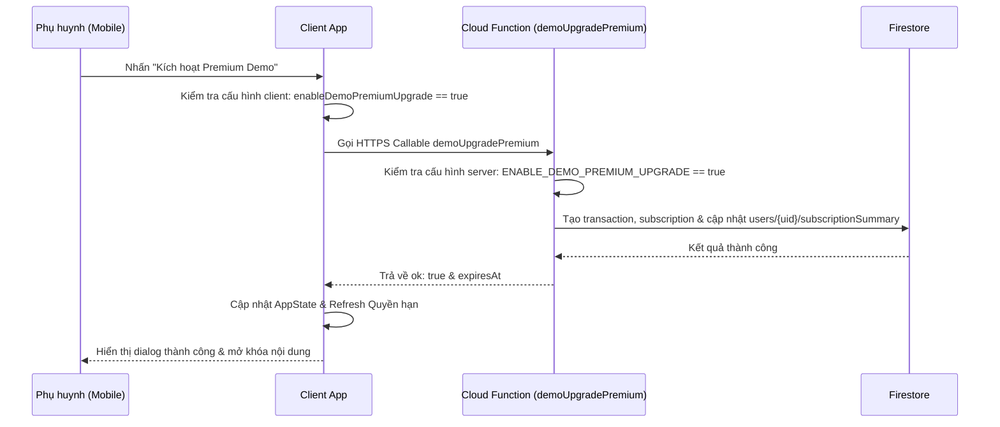

# Quy trình Premium Demo (Phase 5)

Tài liệu này hướng dẫn cách thức hoạt động của luồng nâng cấp Premium Demo, cấu hình kiểm soát và các lưu ý an toàn.

---

## 1. Tổng quan luồng nâng cấp Demo

Do dự án đang trong giai đoạn phát triển và kiểm thử, hệ thống cung cấp một cơ chế **nâng cấp giả lập (Mock Upgrade)** để cho phép cả Admin và Phụ huynh (ở bản cài mobile) tự nâng cấp tài khoản lên Premium để test nhanh các tính năng mà không cần tích hợp cổng thanh toán thật.

---

## 2. Các chốt kiểm soát an toàn (Config Flags)

Để đảm bảo luồng demo không bị rò rỉ ra môi trường Production thực tế, hệ thống bắt buộc kiểm tra đồng thời cả 2 flag ở Client và Server:

### Client-side Config
* **File cấu hình:** `mobile-flutter/lib/core/config/app_config.dart`
* **Thuộc tính:** `AppConfig.enableDemoPremiumUpgrade` (được đọc từ tham số môi trường `--dart-define=ENABLE_DEMO_PREMIUM_UPGRADE=true` hoặc mặc định là `true` trong dev).
* **Vai trò:** Khi flag này bằng `false`, nút **"Kích hoạt Premium Demo"** sẽ hoàn toàn bị ẩn khỏi màn hình Paywall trên di động.

### Server-side Config
* **File cấu hình:** `functions/src/index.ts`
* **Biến số:** `const ENABLE_DEMO_PREMIUM_UPGRADE = true;`
* **Vai trò:** Khi function `demoUpgradePremium` được gọi, nó sẽ kiểm tra biến này đầu tiên. Nếu `ENABLE_DEMO_PREMIUM_UPGRADE === false`, function sẽ lập tức từ chối và ném ra lỗi `failed-precondition`. Điều này ngăn chặn việc hacker dịch ngược code client rồi gọi trực tiếp Cloud Function.

> [!WARNING]
> **Quy định đối với Production:**
> Khi cấu hình dự án chạy ở môi trường thực tế (Production), bắt buộc phải đổi biến `ENABLE_DEMO_PREMIUM_UPGRADE = false` trong Cloud Functions và ẩn nút này tại Client để ngăn người dùng tự nâng cấp miễn phí.

---

## 3. Quy trình Trải nghiệm của Phụ huynh

### Cổng bảo vệ trẻ em (Parent Gate)
* Trẻ em học trong luồng chính (Today Activity, Learning Path Map) sẽ không bao giờ nhìn thấy bảng giá hoặc các lời kêu gọi mua hàng ép buộc.
* Khi trẻ chạm vào một bài học/hoạt động Premium bị khóa (hiển thị màu hổ phách và có vương miện), hệ thống chỉ hiện một hộp thoại nhẹ nhàng: *"Bài học này cần tài khoản Premium. Bé hãy nhờ bố mẹ mở khóa giúp nhé!"*.
* Nút đi tiếp *"Dành cho Bố Mẹ"* sẽ kích hoạt **Parent Gate** (yêu cầu giải một phép nhân ngẫu nhiên, ví dụ: $7 \times 8 = ?$) để đảm bảo trẻ không tự ý truy cập vùng quản trị.
* Chỉ khi vượt qua Parent Gate, màn hình **Paywall** mới được hiển thị.

### Thao tác nâng cấp
1. Phụ huynh truy cập màn hình **Paywall** (thông qua nút nâng cấp trong Parent Dashboard, NPC Collection VIP, hoặc sau khi vượt qua Parent Gate từ bài học bị khóa).
2. Màn hình Paywall trình bày các quyền lợi Premium và có dòng Disclaimer rõ ràng: *"Đây là bản demo kiểm thử Premium. Dự án hiện tại không tích hợp thanh toán thật..."*.
3. Nhấp chọn **"Kích hoạt Premium Demo"**.
4. Hệ thống gọi Cloud Function, lưu thông tin gói cước PREMIUM có hạn dùng 30 ngày.
5. AppState nhận tín hiệu thành công, reload lại profile, và ngay lập tức vẽ lại bản đồ học tập mở khóa toàn bộ bài học.
